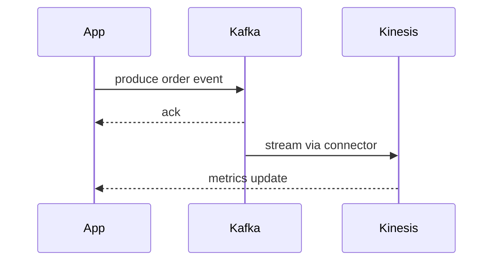

# Edge Inference & Data Connectors

Connectors for services like Stripe, Slack, Shopify, QuickBooks, Zendesk, Kafka and Kinesis can be configured in the portal under `/connectors`. Keys are stored via the orchestrator and used by packages in `@iac/data-connectors`. The connectors now perform real API calls.

## Available Connectors

- **stripe** – provide `stripeKey` from your account
- **slack** – provide a bot `slackKey`
- **shopify** – provide `shopifyKey`
- **quickbooks** – provide `quickbooksKey`
- **zendesk** – provide `zendeskKey`
- **kafka** – provide `kafkaBrokers` and `kafkaTopic`
- **kinesis** – provide `kinesisStream` and `kinesisRegion`

Keys are managed via the `/api/connectors` endpoints:

- `GET /api/connectors` – retrieve saved keys for the current tenant
- `POST /api/connectors` – update one or more keys
- `DELETE /api/connectors/:type` – remove a saved key

This also enables optional TensorFlow.js models to run predictions in the browser for offline support.
The sample workflow below publishes a message to Kafka whenever an order is created and a Kinesis consumer aggregates the events for analytics:

Use `/api/predict` to test models through the portal's connectors page.
